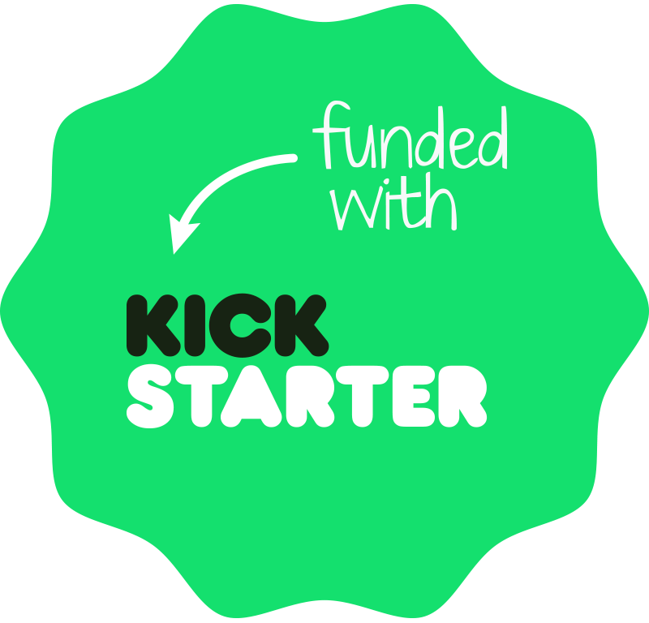

## Machine Learning Kickstarter
> _Independent Study in Business Data Analytics_

We are just finishing our MBAs at Illinois Gies College of Business, with a concentration in Business Data Analytics. We chose this project because we knew it would push us past the skills we have learned in the classroom and hopefully discover some new business insights.

__Did machine learning help us predict which Kickstarter projects would be funded?__

__Did we find any useful advice for soon to be Kickstarter creators?__

__[Dive into our full report to find out!](https://brantdfaulkner.github.io/Machine_Learning_Kickstarter/)__

## Meet The Creators

### Brant D Faulkner

I enjoyed taking on a data analytics project in the _wild_. Building a web scraper in Python and designing a custom database from scratch to get the ball rolling!

Ask me any questions here or [Connect on LinkedIn](https://www.linkedin.com/in/brantdfaulkner/)!

### Courtney Marie Allen

I love group fitness. I guess data is cool too.

Ask me any questions here or [Connect on LinkedIn](https://www.linkedin.com/in/courtneymarieallen/)!
